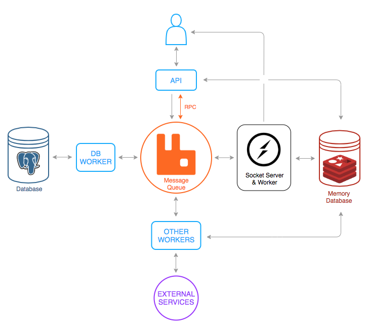

# About
This is a demonstration of how to create simple yet capable architecture with [MOM](https://www.wikiwand.com/en/Message-oriented_middleware) (Message-Oriented-Middleware) approach to achieve well scalable and distributed systems. This demonstration contains two things; first of it is general purpose site routines; like registering an user etc. Other part is the automated job processing demonstration. 

On the tip of the [iceberg](https://www.wikiwand.com/en/Iceberg) we're only seeing an admin panel, where you can register, login, forgot your password, create campaigns etc. But under the hood (or below the sea level?) whole app running by queuing messages to do things. 

# Technologies
- Backend
  - [Docker](https://www.docker.com/)
  - [JWT](https://jwt.io/)
  - [NodeJS](https://nodejs.org/)
    - Libraries
      - [AMQP.Node](https://github.com/squaremo/amqp.node)
      - [Nest Framework](https://nestjs.com/)
      - [TypeORM](http://typeorm.io/)
  - [PostgreSQL](https://www.postgresql.org/)
  - [RabbitMQ](https://www.rabbitmq.com/)
    - Plugins
      - [Delayed Message Exchange](https://github.com/rabbitmq/rabbitmq-delayed-message-exchange)
      - [Management](https://github.com/rabbitmq/rabbitmq-management)
  - [Redis](https://redis.io/)
  - [Socket.io](https://socket.io/)
  - [TypeScript](https://www.typescriptlang.org/)
- Frontend
  - Libraries
    - [Axios](https://github.com/axios/axios)
    - [Material-UI](https://material-ui.com/)
    - [React](https://reactjs.org/)
    - [React-Router](https://github.com/ReactTraining/react-router)
    - [Redux](https://redux.js.org/)
    - [Redux-Saga](https://github.com/redux-saga/redux-saga)

# Installation & Running
To install and run application you only need to have installed and running [docker](https://www.docker.com/products).

#### Cloning Repo
    git clone git@github.com:ramesaliyev/mom-based-architecture-poc.git

#### Start Everything
    docker-compose up --build

#### Start Only Data Services
    docker-compose up postgresql_server postgresql_adminer rabbitmq_server redis_server redis_commander

**Starting everything will take some time**, so be patient. When everything has started you can;
  - Navigate to admin panel at [localhost:9090](http://localhost:9090/)
  - See other [management screens](#management-screens)

# Structure
## Backend
Our main MOM based architecture what is this POC about.

## Frontend
All front-end side of our applicaton. Since this POC is not about front-end architectures I've simply used [create-react-app](https://github.com/facebook/create-react-app) to bootstrap [react](https://reactjs.org/) apps, cleaned up unnecessary things, and created a simply architecture on top of it with [axios](https://github.com/axios/axios), [react-router](https://github.com/ReactTraining/react-router), [redux](https://redux.js.org/), [redux-saga](https://github.com/redux-saga/redux-saga) and [material-ui](https://material-ui.com/). 

### Panel
Right now we have only one front-end app which is our admin panel. 

## Sandbox
Seperated from our main application; the purpose of sandbox is making experiments for grasp better understanding over concepts, libraries etc. For more information and to learn how to use sandbox see [using sandbox](#using-sandbox) section.

## External
A fake api for us to fetch data from. To imitate a real world scenarios external api may randomly;
- take long time to respond
- respond with errors
- occurs timeouts

## Scripts
Some bash scripts to use when needed.

# Management Screens
- Our Panel: [localhost:9090](http://localhost:9090/)
- PostgreSQL: [localhost:9091](http://localhost:9091/)
  - **system:** *PostgreSQL*
  - **server:** *postgresql_server*
  - **username:** *poc_db_user*
  - **password:** *poc_db_pass*
  - **database:** *poc_db_name*
- RabbitMQ: [localhost:9092](http://localhost:9092/)
  - **username:** *poc_rmq_user*
  - **password:** *poc_rmq_pass*
- Redis: [localhost:9093](http://localhost:9093/)

#  Connection Points
- API:
  - **hostname:** localhost:7070
- Socket:
  - **hostname:** localhost:7080
- External Math Service API:
  - **hostname:** localhost:7090
- PostgreSQL
  - **hostname:** localhost:7071
  - *others same as above*
- RabbitMQ
  - **hostname:** localhost:7072
  - *others same as above*
- Redis
  - **hostname:** localhost:7073

# Resources for Better Understanding 
  - Docker
    - [Building Efficient Dockerfiles - Node.js](http://bitjudo.com/blog/2014/03/13/building-efficient-dockerfiles-node-dot-js/)
  - MOM
    - [Wikipedia](https://www.wikiwand.com/en/Message-oriented_middleware)
  - RabbitMQ
    - [Dictionary](/sandbox/rabbitmq/about.md)
    - Official
      - [JS Tutorial](https://www.rabbitmq.com/tutorials/tutorial-one-javascript.html)
      - [Github Repo of Tutorial](https://github.com/rabbitmq/rabbitmq-tutorials/tree/master/javascript-nodejs)
      - [AMQP Concepts](https://www.rabbitmq.com/tutorials/amqp-concepts.html)
      - [Documentation](https://www.rabbitmq.com/documentation.html)
      - [Queues](https://www.rabbitmq.com/queues.html)
    - Other
      - [AMQP.Node API Reference](http://www.squaremobius.net/amqp.node/channel_api.html)
      - [What is RabbitMQ?](https://www.cloudamqp.com/blog/2015-05-18-part1-rabbitmq-for-beginners-what-is-rabbitmq.html)
      - [Getting Started with RabbitMQ and NodeJS](https://www.cloudamqp.com/blog/2015-05-19-part2-2-rabbitmq-for-beginners_example-and-sample-code-node-js.html)
      - [Management Interface](https://www.cloudamqp.com/blog/2015-05-27-part3-rabbitmq-for-beginners_the-management-interface.html)
      - [RabbitMQ Exchanges, Routing Keys and Bindings](https://www.cloudamqp.com/blog/2015-09-03-part4-rabbitmq-for-beginners-exchanges-routing-keys-bindings.html)
      - [RabbitMQ and NodeJS, A better way.](https://kimambo.de/a-better-way-to-work-with-rabbitmq-and-nodejs/)
      - [How To Do User Notifications From RabbitMQ Messages](https://derickbailey.com/2015/09/21/how-to-do-user-notifications-from-rabbitmq-messages/)
  - TypeScript
    - [In 5 Minutes](https://www.typescriptlang.org/docs/handbook/typescript-in-5-minutes.html)
    - [Handbook](https://www.typescriptlang.org/docs/handbook/basic-types.html)

# Using Sandbox
There is a sandbox to ease making experiments with things. It consist of mostly little scripts written in plain javascript by following tutorials etc. You can add something under the sandbox and run it within container. Since folder already added as volume you dont need to restart anything. To enter in sandbox;

    docker exec -it poc_sandbox /bin/sh

And when you in, simply run scripts as you want;
    
    node rabbitmq/tutorial/hello-world/send.js

Create a new terminal window and run the receiver also;

    node rabbitmq/tutorial/hello-world/receive.js

You can run multiple receivers to observe things.

# Debugging
## Frontend
For front-end debugging start containers without panel. You can also start management containers if you want.
    
    docker-compose up api postgresql_server rabbitmq redis_server
    
Then start panel locally.

    npm i
    npm start
  
Now you can use your favorite editor to debugging. [See here](/frontend/panel/README.md) for editor integrations.

# TODO
- Some visualisation about journey of messages would be nice.
- Use RabbitMQ with rabbitmq-delayed-message-exchange [plugin](https://hub.docker.com/r/tetsuobe/rabbitmq-delayed-message-exchange/~/dockerfile/).